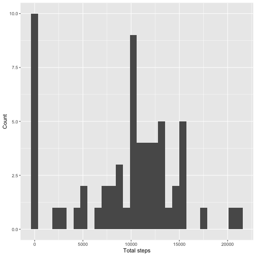
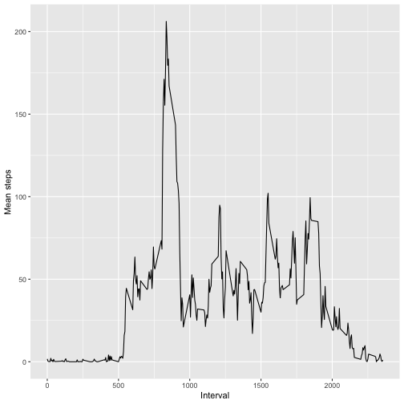
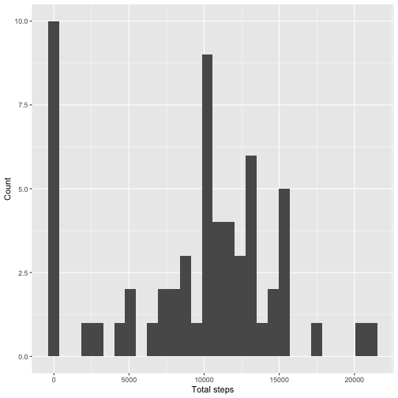
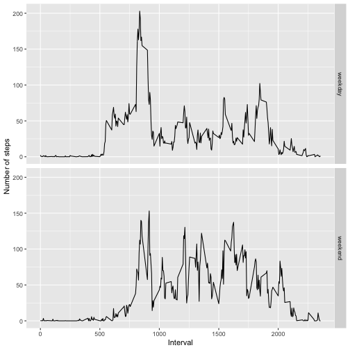

```r
# Importing required libraries
library(dplyr)
library(ggplot2)
library(tidyr)
```


## Loading and preprocessing the data

```r
activity = read.csv(unz("activity.zip", "activity.csv"), stringsAsFactors = FALSE, na.strings = "NA")
```


## What is mean total number of steps taken per day?

```r
# Calculate the steps by date
steps_per_day = activity %>%
  group_by(date) %>%
  summarise(total_steps=sum(steps, na.rm=TRUE))
```


```r
# Generate histogram of the daily steps
ggplot(data=steps_per_day, aes(x=total_steps)) + geom_histogram() + labs(x='Total steps', y='Count')
```

```
## `stat_bin()` using `bins = 30`. Pick better value with `binwidth`.
```




```r
# Summarizing mean and median
steps_per_day %>% 
  summarise(
    daily_steps_mean=mean(total_steps),
    daily_steps_median=median(total_steps)
  )
```

```
## # A tibble: 1 × 2
##   daily_steps_mean daily_steps_median
##              <dbl>              <int>
## 1            9354.              10395
```


## What is the average daily activity pattern?

```r
interval_mean = activity %>%
  group_by(interval) %>%
  summarize(mean_steps=mean(steps, na.rm=TRUE))


# Viewing the intervall mean over days
ggplot(data=interval_mean, aes(x=interval, y=mean_steps)) + geom_line() + labs(x='Interval', y='Mean steps')
```



```r
# Finding the interval with the greatest mean
interval_mean %>% 
  arrange(desc(mean_steps)) %>%
  slice(1)
```

```
## # A tibble: 1 × 2
##   interval mean_steps
##      <int>      <dbl>
## 1      835       206.
```

The 835 interval was the interval were the steps were the maximum in this dataset.


## Imputing missing values


```r
# Counting na by column
sapply(activity, function(y) sum(length(which(is.na(y)))))
```

```
##    steps     date interval 
##     2304        0        0
```


```r
new_activity = merge(activity, interval_mean, by='interval', all.x=TRUE)

# Fill na with mean steps in interval
new_activity$steps[is.na(new_activity$steps)] = new_activity$mean_steps
```

```
## Warning in new_activity$steps[is.na(new_activity$steps)] = new_activity$mean_steps: number of items to replace is not a multiple of replacement
## length
```

```r
new_activity = new_activity %>%
  arrange(date, interval) %>%
  select(date, interval, steps)

sapply(new_activity, function(y) sum(length(which(is.na(y)))))
```

```
##     date interval    steps 
##        0        0        0
```


```r
# Calculate the steps by date
new_steps_per_day = new_activity %>%
  group_by(date) %>%
  summarise(total_steps=sum(steps))


# Generate histogram of the daily steps
ggplot(data=new_steps_per_day, aes(x=total_steps)) + geom_histogram() + labs(x='Total steps', y='Count')
```

```
## `stat_bin()` using `bins = 30`. Pick better value with `binwidth`.
```




```r
# Summarizing mean and median
new_steps_per_day %>% 
  summarise(
    daily_steps_mean=mean(total_steps),
    daily_steps_median=median(total_steps)
  )
```

```
## # A tibble: 1 × 2
##   daily_steps_mean daily_steps_median
##              <dbl>              <dbl>
## 1            9371.              10395
```

For the mean the difference is low and for the median there is no change. Maybe it could be that the missing values were clustered where the steps count were low.


## Are there differences in activity patterns between weekdays and weekends?


```r
# Adding weekday as factor
new_activity= new_activity %>%
  mutate(date=as.Date(date)) %>%
  mutate(weekday=ifelse(weekdays(date) %in% c("Saturday", "Sunday"), "weekend", "weekday"), weekdays(date)) %>%
  mutate(weekday=as.factor(weekday))

# Generating aggregated data by weekday
steps_by_interval_weekday = new_activity %>%
  group_by(interval, weekday) %>%
  summarise(avg_steps=mean(steps, na.rm=TRUE))
```

```
## `summarise()` has grouped output by 'interval'. You can override using the `.groups` argument.
```

```r
# Plotting aggregated data
ggplot(data=steps_by_interval_weekday, aes(x=interval, y=avg_steps)) + labs(x='Interval', y='Number of steps') + geom_line() + facet_grid(rows=vars(weekday))
```




It looks that on the weekend the steps were more evenly distributed during the day, and on weekdays it peaks between 750-1000 and the remain in more lower values.
